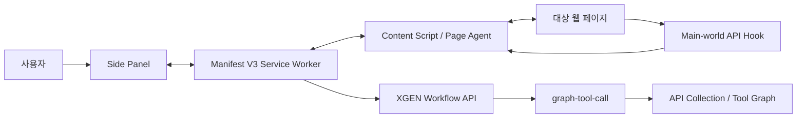
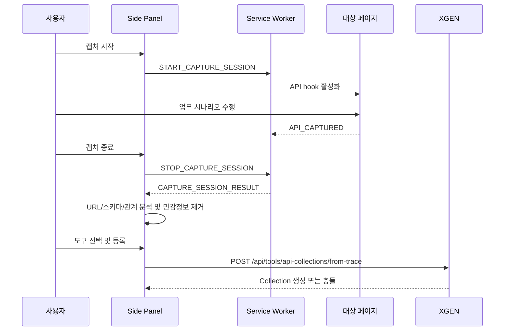

# Architecture

## 책임 경계

Pathfinder는 브라우저 관찰 및 사용자 인터랙션 계층이다. API Collection 저장, graph build, tool search 및 실행은 XGEN과 graph-tool-call의 책임이다.

| 구성요소 | 책임 |
|---|---|
| Side Panel | 채팅, 캡처 시작/종료, 분석 결과 선택, Collection 등록 |
| Service Worker | 탭 고정, 인증 컨텍스트, SSE relay, 캡처 세션 및 XGEN 요청 |
| Content Script | 페이지 컨텍스트 추출, 페이지 명령 실행, main-world hook relay |
| Main-world API Hook | 페이지의 fetch/XHR 요청 및 응답 관찰 |
| XGEN | 사용자 인증, Collection 저장, graph build, 검색, plan 및 실행 |
| graph-tool-call | OpenAPI/trace contract, semantic graph, retrieval 및 selector |

## API 캡처 흐름

캡처 결과는 method, templated path, path/query parameter, 제한된 request/response sample, 도구 의미 메타데이터 및 관찰된 관계 edge로 정규화된다. 등록 payload의 크기와 깊이는 `trace-registration.ts`의 상한으로 제한된다.

## 페이지 제어 흐름

Page Agent는 현재 DOM을 snapshot으로 만들고 사용 가능한 요소를 인덱싱한다. XGEN이 `page_command`를 반환하면 Service Worker가 고정된 대상 탭의 Content Script로 전달한다. 명령 후 DOM을 다시 읽어 실제 결과를 XGEN의 command-result endpoint로 반환한다.

명령 성공은 “메시지를 보냈다”가 아니라 DOM 재관찰 결과를 기준으로 판단해야 한다.

## 상태와 생명주기

Manifest V3 Service Worker는 유휴 상태에서 종료되고 다시 시작될 수 있다. 영속 상태는 `chrome.storage.local`에 저장하고, 실행 중 cache는 복구 가능한 보조 상태로 취급한다.

탭별 캡처는 다음 원칙을 따른다.

- 캡처 대상 탭을 명시적으로 고정한다.
- 다른 탭의 요청은 현재 세션에 섞지 않는다.
- SPA navigation 후 Content Script와 API hook을 다시 확인한다.
- 이전 세션의 캡처는 새 세션에 포함하지 않는다.

