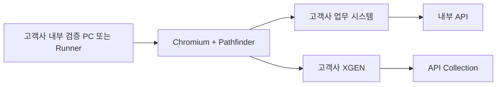

# Customer Environment

## 권장 배치

고객사 내부 API를 스캔하려면 브라우저와 검증 runner가 해당 시스템에 접근 가능한 네트워크에 있어야 한다.

외부 CI가 내부 API에 직접 접근하도록 방화벽을 여는 방식은 권장하지 않는다. 고객사 내부에 self-hosted runner 또는 전용 검증 PC를 둔다.

## 사전 체크리스트

### 네트워크

- 내부 DNS가 대상 host를 해석한다.
- XGEN과 대상 시스템에 HTTPS 접근할 수 있다.
- proxy가 WebSocket/SSE 또는 장시간 HTTP stream을 차단하지 않는다.
- 사설 CA가 OS와 Chromium trust store에 설치되어 있다.
- VPN reconnect 후 세션 동작을 확인한다.

### 계정

- 전용 테스트 사용자 사용
- read-only 권한부터 시작
- MFA/SSO 갱신 주기 확인
- 운영 데이터 변경 권한 최소화
- 테스트 종료 후 session과 auth profile 폐기 절차 준비

### XGEN

- 테스트 tenant/project 준비
- API Collection 생성 권한
- auth profile 조회/생성 권한
- graph build와 Quality Lab 권한
- 테스트 결과 및 Collection 삭제 방법 확인

## 설치 방식

개발·검증 단계에서는 unpacked extension을 사용한다. 고객 배포 단계에서는 서명된 extension package 또는 조직 정책 기반 배포를 사용한다.

조직 정책 배포 시 확인할 항목:

- extension ID 고정
- 허용된 update URL
- 필요한 host permission 검토
- 브라우저 정책의 side-loading 제한
- 자동 업데이트 및 rollback 절차

## Acceptance 시나리오

1. XGEN 로그인과 provider 조회
2. 외부 업무 페이지에서 Side Panel 열기
3. Page Agent가 현재 URL과 DOM을 읽는지 확인
4. read-only 사용자 시나리오 캡처
5. 민감 query/body 값이 등록 payload에서 제거되는지 확인
6. auth profile 자동 연결 또는 명시적 선택
7. API Collection 생성 및 graph build
8. 한국어 업무 질의로 search Top-K 확인
9. plan 생성 확인
10. read-only API execute 확인
11. 브라우저 재시작과 Service Worker 재시작 후 복구 확인

## 자동화가 제한되는 영역

- CAPTCHA
- hardware token 또는 생체 인증
- 승인 앱을 통한 MFA
- Citrix/VDI 화면 내부의 DOM 비노출 애플리케이션
- 브라우저가 아닌 native client 통신
- certificate pinning 또는 custom protocol

이 영역은 로그인 완료 후 자동 검증을 이어가거나 수동 acceptance 단계로 둔다. 인증 우회를 구현하지 않는다.

## 종료 및 정리

- 테스트 Collection과 auth profile 삭제 여부 확인
- Playwright 임시 user-data-dir 삭제
- screenshot/trace에서 개인정보 제거
- 전용 계정 session revoke
- 테스트 중 생성한 업무 데이터 cleanup
- 결과에는 버전, 환경, 성공/실패 stage만 보존

